<div align="center">
  
</div>

<p align="center">
  <a href="https://kaicryan.dev"></a>&nbsp;
  <a href="https://linkedin.com/in/kaicryan"></a>&nbsp;
  <a href="mailto:kaithecryan@gmail.com"></a>&nbsp;
  
</p>

<p align="center"><sub><i>The work is mysterious and important.</i></sub></p>

---

<p align="center"><sub><code>LUMON INDUSTRIES ▸ WING C ▸ SEVERED FLOOR</code></sub></p>

### ▚ PERSONNEL FILE

```
+--------------------------------------------------------------+
|  LUMON INDUSTRIES / EMPLOYEE RECORD / FILE 0x2C              |
+--------------------------------------------------------------+
|  NAME         Kai Cryan                                      |
|  DESIGNATION  Software Developer, Macrodata Refinement       |
|  SITE         Sydney, AU  (remote-eligible)                  |
|  FOCUS        Backend / Infrastructure / Networking / Linux  |
|  CLEARANCE    Junior Developer, Japan Secure Solutions       |
|  STATUS       ACTIVE  -  innie and outie in good standing    |
+--------------------------------------------------------------+
```

My work is mysterious and important. In practice that means backend services in
**Go**, self-hosted infrastructure, networking, and **Linux** — the parts that
stay invisible until they break. Outside the building I'm a penultimate-year
**Bachelor of Information Technology** student at Macquarie University
(Software Technology major).

---

<p align="center"><sub><code>LUMON INDUSTRIES ▸ WING C ▸ MDR</code></sub></p>

### ▚ REFINEMENT QUEUE

Work currently on the terminal:

```
+----------------------------------------------------------------------+
|  Japan Secure Solutions ... junior developer                         |
|  Home lab ................. self-hosted DNS / DHCP, Zigbee sensors   |
|  Freelance ................ web design, spec to launch               |
|  Algorithms ............... daily practice, C++ and Java             |
+----------------------------------------------------------------------+
```

---

<p align="center"><sub><code>LUMON INDUSTRIES ▸ WING B ▸ O&amp;D</code></sub></p>

### ▚ AUTHORIZED EQUIPMENT

Issued to this workstation:


---

<p align="center"><sub><code>LUMON INDUSTRIES ▸ SUB-LEVEL 1 ▸ ARCHIVES</code></sub></p>

### ▚ FILES ON RECORD

**`omarchy-lumon-*`** — an eight-repo suite that re-skins the entire
[Omarchy](https://omarchy.org) Linux experience, boot splash to lock screen,
after *Severance*. Selected files:

| File | Contents |
| --- | --- |
| [omarchy-lumon-theme](https://github.com/KaiCryan/omarchy-lumon-theme) | Look-and-feel, fastfetch and branding for the whole desktop |
| [omarchy-lumon-wallpapers](https://github.com/KaiCryan/omarchy-lumon-wallpapers) | Generated ASCII character portraits + brand set, hourly cycler |
| [omarchy-lumon-screensaver](https://github.com/KaiCryan/omarchy-lumon-screensaver) | Capped-FPS TTY effects and an ambient scene reel |
| [omarchy-desktop-quote](https://github.com/KaiCryan/omarchy-desktop-quote) | Rotating quote overlay for the Omarchy desktop (QML) |

<sub>Also on file: <a href="https://github.com/KaiCryan/LeetCode">LeetCode</a> — daily algorithm practice · full suite and more in the pins above.</sub>

---

<p align="center"><sub><code>LUMON INDUSTRIES ▸ PERPETUITY WING</code></sub></p>

### ▚ OUTIE CORRESPONDENCE

The outie may be reached through approved channels:

- **Portfolio** — [kaicryan.dev](https://kaicryan.dev)
- **LinkedIn** — [linkedin.com/in/kaicryan](https://linkedin.com/in/kaicryan)
- **Email** — [kaithecryan@gmail.com](mailto:kaithecryan@gmail.com)

---

<p align="center"><sub><code>LUMON INDUSTRIES ▸ GROUND FLOOR ▸ ELEVATOR</code></sub></p>

<div align="center">
  
  <br />
  <sub><code>tame thy tempers</code> &nbsp;·&nbsp; <code>the work is mysterious and important</code> &nbsp;·&nbsp; <code>praise Kier</code></sub>
</div>
